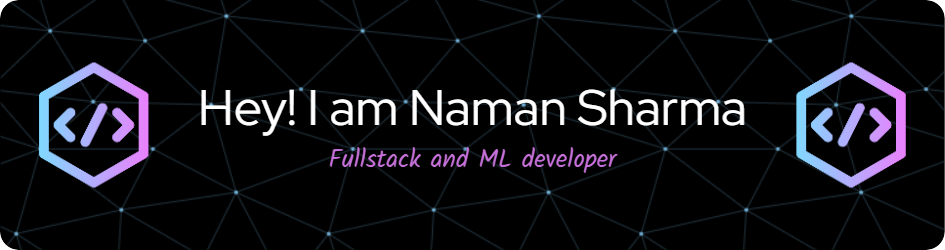

<h3 align="center">I am a Full Stack Web and Android Developer with some experience in ML/AI</h3>

  

- 🔭 I’m currently working on **Digital Image Processing and Big Data**

- 🌱 I’m currently learning **Rust, Golang**

- 📫 How to reach me **ns9650855@gmail.com**

<h3 align="left">Connect with me:</h3>

<h3 align="left">Languages and Tools:</h3>

                  

&nbsp;

